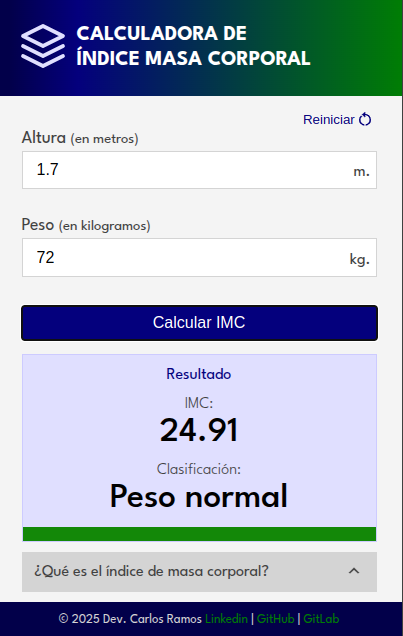

# Calculador IMC

Es una aplicación que calcula el Indice de Masa Corporal segun la Organización Mundial de Salud.

> **Nota**: El resultado de esta calculadora es meramente informativo y no así un diagnostico absoluto.

## Técnologia utilizadas

Esta aplicación fue implementado con HTML, CSS y JavaScript vanila, no se utilizó librerias.

## Layout inicial de la aplicación

El diseño inicial se enfocó en estructurar los elementos de la aplicación.

## Diseño final

La aplicación final se la siguiente:

## Información a cerca de IMC

**¿Qué es el IMC?**

El índice de masa corporal (IMC) es la relación
entre la masa corporal de una persona y
su estatura. Según los valores propuestos por
la Organización Mundial de la Salud
(OMS), el IMC es uno de los principales
recursos para evaluar el estado nutricional.

**¿Cómo se calcula el IMC?**
$$
IMC = Peso (kg) / altura (m)^2
$$

**Clasificación del estado nutricional de acuerdo al IMC**

    bajo peso         IMC < 18,5
    peso saludable    18,5 >= IMC <= 24,9
    sobrepeso         24.9 >= IMC = <= 29,9
    obesidad          IMC > 30

**Referencias bibliogŕaficas**:

- OMS https://www.who.int/data/gho/data/themes/topics/topic-details/GHO/body-mass-index
- Body Mass Index formula https://www.healthychildren.org/Spanish/health-issues/conditions/obesity/Paginas/body-mass-index-formula.aspx

## Developer

- Author: Carlos Ramos
- Linkedin: https://www.linkedin.com/in/carlosramos05/
- GitHub: https://github.com/carlosramos1